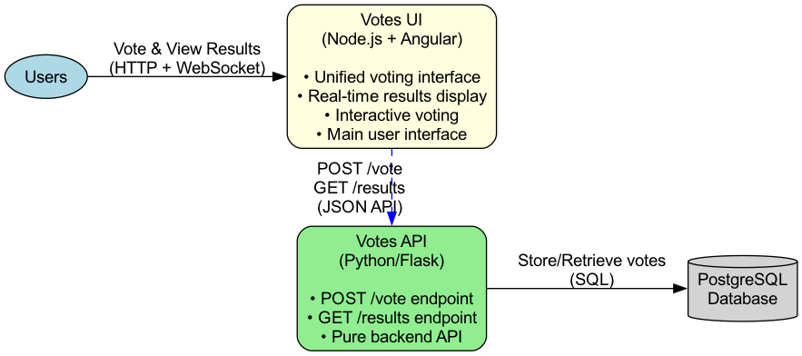

# DevOps Challenge


## Overview

This repository contains a simple voting application comprised of two microservices and a database. The application allows users to vote between two options and view real-time results. Each directory contains a README with details of the individual app.

### Architecture

The application consists of three main components:

* **Votes API** - A Python/Flask backend API that handles vote submissions and provides results endpoints
* **Votes UI** - A Node.js web application that provides a unified interface for voting and viewing real-time results
* **PostgreSQL Database** - Stores the voting data

#### Architecture Diagram



You can regenerate the diagram(with graphviz installed on your machine) using the following command:

```bash
dot -Tpng architecture.dot -o architecture.png
```


### Endpoints

**Votes UI**
- `GET /` - Unified voting and results interface (HTML + WebSocket)
- `GET /healthz` - Health check endpoint (JSON)


**Votes API**
- `GET /` - API information and voting options (JSON)
- `GET /healthz` - Health check endpoint (JSON)
- `POST /vote` - Submit vote (JSON)
- `GET /results` - Get voting results (JSON)


## How to complete this challenge

Your task is to deploy this application to a Kubernetes cluster in your local environment and provide instructions for reproduction on our own computers. The deployment should meet the following criteria:

1. **Kubernetes Deployment**: Deploy all components to a local Kubernetes cluster. You are free to choose any Kubernetes flavor that you are comfortable with, like `minikube`, `k3s`, `kind`, etc.
2. **IaC tooling**: Use Infrastructure as Code (IaC) tooling of your choice to deploy the application. This could be `Terraform`, `Pulumi`, `Crossplane`, `Ansible`, `Helm`, etc. The idea here is to use some IaC tool to orchestrate all the pieces together, this means that you should not provide just raw Kubernetes .yaml files and expect us to manually run `kubectl` commands to deploy the application.
3. **Working Application**: Both voting and results functionality must work end-to-end, make sure there are no errors shown in the UI
4. **Database**: PostgreSQL container should be deployed in the same cluster
5. **Documentation**: Provide clear instructions for reproducing your deployment and accessing the application
6. **Accessibility**: The UI should be accessible via `http://{SOME_URL}:{PORT}` (don't worry about HTTPS)


## How to submit the challenge

1. **Create a Private Repository**: Create a new **private repository** in your own Github user
2. **Commit your changes**: Clone this repository and commit your changes to your **private repository**
3. **Write some instructions**: Write clear instructions in a `DEPLOYMENT.md` file on how to reproduce your deployment
4. **Add Collaborators**: Invite the following GitHub users as collaborators:
   - `@bgroupe`
   - `@heruscode`
   - `@tleung999`

The estimated effort of this challenge is approximately 4 hours. Feel free to include any additional notes about how you would improve this as if it were your job to maintain it in a production environment. Submit a link to your private repository.
